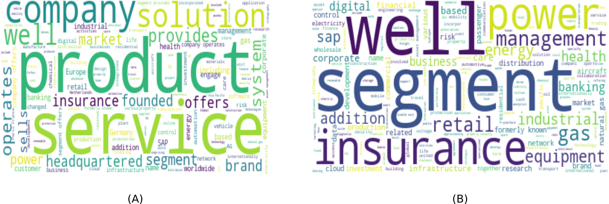
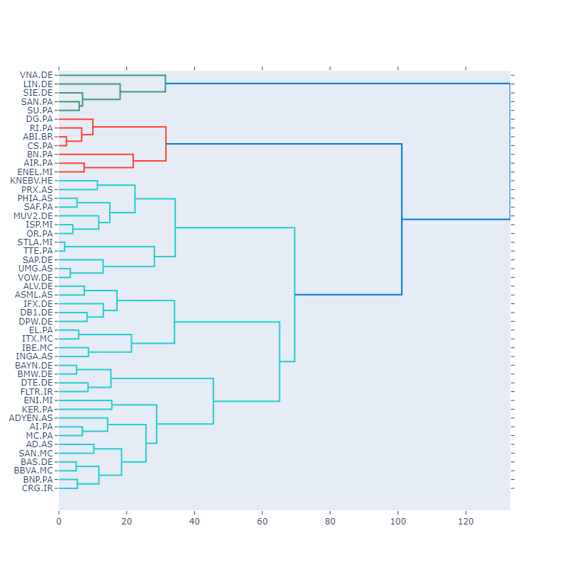

```{r setup, include=FALSE}
knitr::opts_chunk$set(echo = FALSE, warning = FALSE, message = FALSE)
```

# Introduction

The report outlines an alternative method to find stock peers through natural language processing of business descriptions of a company. The company value chain is highly connected in the current globalized world. The specialized patented products, commodity availability, cost, and similar factors contributing to value-chain connectivity. Therefore, looking into same sector peers won't give the whole picture. The report describes the novel method to find peers by applying text clustering on the business description. The method can be used as a complementary method to identify stock peers. 

The report is organized in three sections. The methods section describe the data source, algorithm, and technology used for the analysis. The results section outline the results of the analysis. Finally, conclusion provides the discussion and future work. 

# Methods

Since this is a methodology paper to keep the data size and computation time manageable I used EuroStoxx 50 [@stoxx50] as a universe. Furthermore, the data for this universe is available for all stocks on the Yahoo finance [@yahoo]. So, I pulled the data from Yahoo finance using yfinance library [@yfin]. The fields symbol, sector, industry, and longBusinessSummary are used in the analysis. The *longBusinessSummary* is used as input text. 

Next, term frequency–inverse document frequency (TF-IDF) [@tfidf] transformation is used to create features. I decided to choose Hierarchical cluster as a preferred method for the clustering, since the algorithm does not require initial number of cluster as an input parameter. Also, I use `l1` distance measure, since data is very sparse. 

Apart from removing standard stop-words I also removed stop words like *co, ltd, llc*. Next, I demonstrate the effect of customized data cleaning on the business descriptions through word cloud. The panel A in figure \@ref(fig:fig1) shows the word frequency of business description without customized data cleaning. The panel B \@ref(fig:fig1) shows the effect of customized stop-words removal. 

```{r fig1, layout = "l-body-outset", fig.cap="Wordcloud comparison showing effect of customized data cleaning"}

```

For the technology I used python data science stack [@scikit, @textblob, @nltk]. Besides, I used [MLflow](https://www.mlflow.org/) [@mlflow] and Snakemake [@smake] for workflow management. The source code is available on Github [https://github.com/r2rahul/thematic](https://github.com/r2rahul/thematic). 


 
# Results

In the section I present two results from the analysis. First, I show the hierarchical cluster dendrogram. Given, the text is very sparse, still the cluster is able to capture sector level homogeneity. If I cut the tree around 30, I get 10 clusters, which is close to 11 sector classification available in the universe. In addition, the distribution of sector is also skewed in the universe with Financial Services and consumer cyclical are most represented, while Real Estate is least represented. 

```{r dendo, layout = "l-body-outset", fig.cap = "The figure shows the final cluster groups based on the business description"}

```

Second, the model is quite homogeneous at the terminal nodes with one or two cross-sector symbols in the group. For example, in red cluster ABI.BR and RI.PA belong to same sector, whereas CS.PA and RI.PA belong to different sectors. Figure \@ref(fig:wc) compares the word cloud of the cluster group. Therefore, demonstrating that it is feasible to find stock peers through natural language processing. 


```{r wc1}
library(tidyverse)
library(glue)
library(quanteda)
library(quanteda.textplots)
df <- read_csv("../data/forreport.csv")
corp <- corpus(df, text_field = "business_desc")
```

```{r wc, layout = "l-body-outset", fig.cap = "The wordcloud showing comparison of words in cluster in red"}
corp %>%
    tokens(remove_punct = TRUE) %>%
    dfm() %>%
    dfm_group(groups = sector) %>%
    dfm_trim(verbose = FALSE) %>%
    textplot_wordcloud(comparison = TRUE,
                       min_size = 1,
                       max_size = 6,
                       min_count = 1, 
                       color = c('#a6cee3','#1f78b4',
                        '#b2df8a','#33a02c'))
```


# Conclusion

In this report I described the methodology of finding peers through business description and natural language processing. I demonstrated the methodology by mining the public information through Yahoo finance [@yahoo] and using hierarchical cluster to identify clusters based on business descriptions. The method is able to find homogeneous cluster with non-intuitive peers based on the business words. 

The method provides two important knobs to tweak, when working on actual data provided by commercial data vendors and texts from annual reports. First, input data the description can be more detailed as mentioned in the annual reports. The large corpus will need more careful feature engineering, like log transformation to represent all words meaningfully. Second, hyper-parameter tuning of the cluster algorithm. Since, the algorithm is very sensitive to choice of distance and linkage method, a more detailed training will be required. The report outlined a complimentary method for finding non-intuitive peer stocks using NLP and method will be helpful in the portfolio management. 

